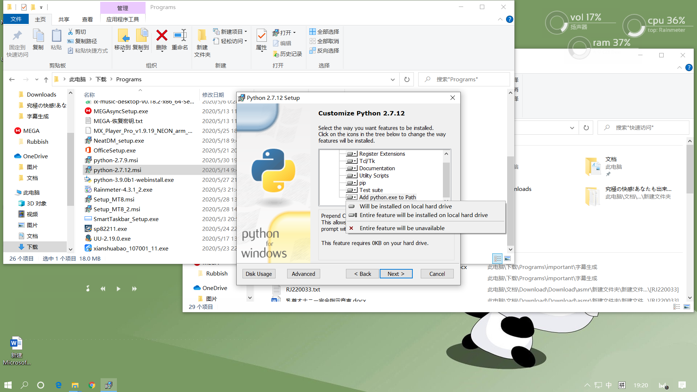
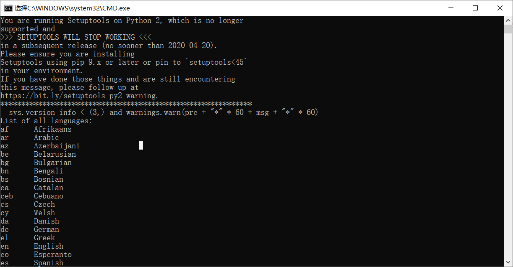
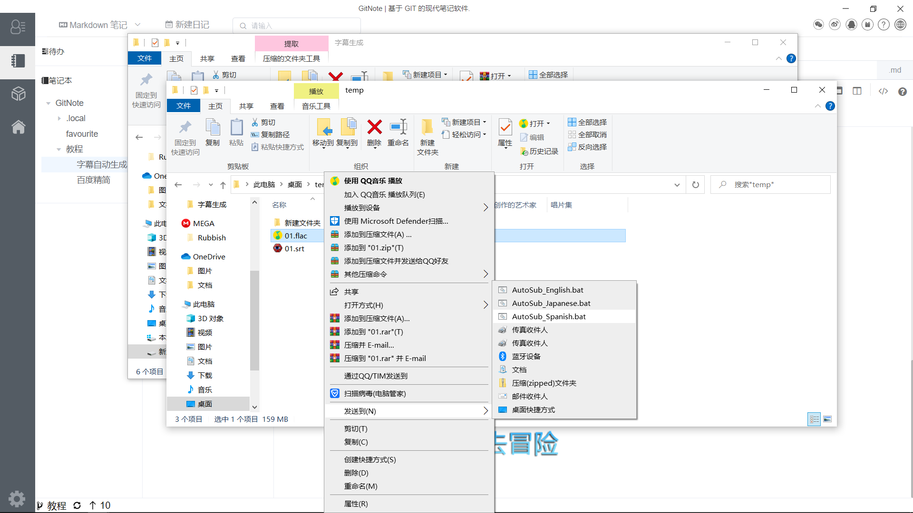

# 相关软件下载
[Python](https://www.python.org/ftp/python/2.7.12/python-2.7.12.msi)

[FFMPEG](https://ffmpeg.zeranoe.com/builds/)

[AutoInstall](https://pypi.org/project/autosub/)

# **安装教程**
## 1.安装python

## 2.Run cmd (Win+R)

--------------------------------
C:\Python27\Scripts\pip.exe install "‪‪D:\File\desk\autosub-0.3.12.tar.gz"
--------------------------------

## 3.修改文件名  "autosub" to "autosub_app.py"
cmd命令 
------------------------
rename C:\Python39\Scripts\autosub autosub_app.py
------------------------

## **4.修改autosub_app.py文件**
### 4.1 在47行添加", delete=False"
temp = tempfile.NamedTemporaryFile(suffix='.flac')
修改成
temp = tempfile.NamedTemporaryFile(suffix='.flac', delete=False)
### 4.2 修改127行
exe_file = os.path.join(path, program)
修改成
exe_file = os.path.join(path, program + ".exe")
## **5.ffmpeg布置**
下载(https://ffmpeg.zeranoe.com/builds/) 并复制bin文件夹中的ffmpeg.exe 到 C:\Python27\（python的安装目录，版本不同文件名和路径可能不同）

## **6.重启电脑**

## **7.Test Script**
-----------------------------------
C:\Python39\python.exe C:\Python39\scripts\autosub_app.py --list-languages
-----------------------------------
//自己修改目录

# **自动生成字幕**
-----------------------------------
**1.Spanish**
C:\Python27\python.exe C:\Python27\scripts\autosub_app.py -S es -D es TuVideo.mp4
**2.English**
C:\Python27\python.exe C:\Python27\scripts\autosub_app.py -S en -D en YouVideo.mp4
**3.Japanese**
C:\Python27\python.exe C:\Python27\scripts\autosub_app.py -S ja -D ja YouAnimeVideo.mp4
-----------------------------------
*Optional
Compile script Python(Exe Executable)
C:\Python27\python.exe -m compileall C:\Python27\scripts\autosub_app.py
Run
C:\Python27\scripts\autosub_app.pyc YouVideo.mp4 (English Default)
Upgrade Pip
python -m pip install --upgrade pip*

# 添加到右键快捷方式

Create batch by language (JA) AutoSub_Jap.bat and copy to directory SendTo
"shell:sendto"
"%APPDATA%\Microsoft\Windows\SendTo"
AutoSub_Jap.bat
C:\Python27\python.exe C:\Python27\Scripts\autosub_app.py -C 2 -S ja -D ja %1

# **字幕翻译软件 Subtitle Edit** 
Download [Subtitle Edit](https://github.com/SubtitleEdit/subtitleedit/releases)

Run SubtitleEdit.exe
Open Subtitle (TuVideo.srt,YouAnimeVideo.srt,YouVideo)
Menu-Auto-Translate-(PowerbyGoogle)
From(Japanese) To:English
Translate

