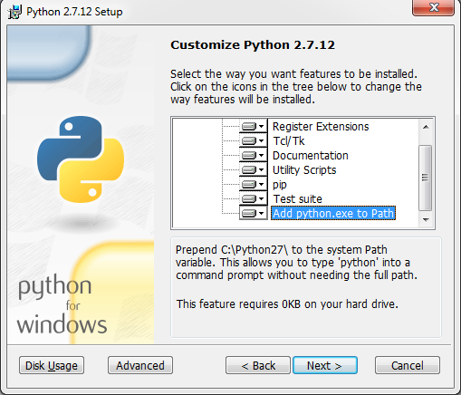

# 相关软件下载
[Python](https://www.python.org/ftp/python/2.7.12/python-2.7.12.msi)
[FFMPEG]()
AutoInstall autosub_app 0.3.12.zip
SampleVideos Spanish - English.zip
Subtitle Editor Aegisub

# 安装教程
## **1.安装python**

## **2.Run cmd (Win+R)**
C:\Python27\Scripts\pip.exe install autosub
Or
C:\Python27\Scripts\pip.exe install https://pypi.python.org/packages/35/7b/9d5361c0f7abfcc6d826a5279b1c4501f7616505629f6c54857587ec6e37/autosub-0.3.9.tar.gz
or
(Download Last version autosub https://pypi.python.org/pypi/autosub)
C:\Python27\Scripts\pip.exe install "c:\youdownloaded\autosub-0.3.9.tar.gz"

