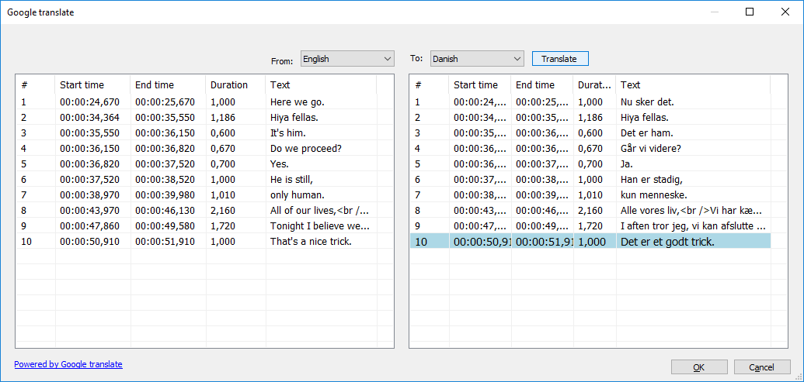

# 相关软件下载
[Python](https://www.python.org/ftp/python)

[FFMPEG](https://ffmpeg.zeranoe.com/builds/)

[AutoInstall](https://pypi.org/project/autosub/)

![Subtitle Editor Aegisub]

# **安装教程**
## **1.安装python**

## **2.Run cmd (Win+R)**
**C:\Python27\Scripts\pip.exe install autosub**
// 自己python的安装目录
or
[Download Last version autosub ](https://pypi.python.org/pypi/autosub)
C:\Python27\Scripts\pip.exe install "c:\youdownloaded\autosub-0.3.9.tar.gz"    //0.3.9更改为最新版本号

## **3.修改文件名  "autosub" to "autosub_app.py"**
------cmd命令  C:\Python27\Scripts\autosub autosub_app.py--------

## **4.修改autosub_app.py文件**
### 4.1 在47行添加", delete=False"
temp = tempfile.NamedTemporaryFile(suffix='.flac')
修改成
temp = tempfile.NamedTemporaryFile(suffix='.flac'**, delete=False**)
### 4.2 删除53行的os.system('stty sane'). (Optional)
### 4.3 Line 127 change
exe_file = os.path.join(path, program)
exe_file = os.path.join(path, program** + ".exe"**)
## **5.ffmpeg布置**
Download(https://ffmpeg.zeranoe.com/builds/) and
Copy ffmpeg.exe to C:\Python27\

## **6.Restart Windows**

## **7.Test Script C:\Python27\python.exe C:\Python27\scripts\autosub_app.py --list-languages**

# **自动生成字幕**
-----------------------------------
**1.Spanish**
C:\Python27\python.exe C:\Python27\scripts\autosub_app.py -S es -D es TuVideo.mp4
**2.English**
C:\Python27\python.exe C:\Python27\scripts\autosub_app.py -S en -D en YouVideo.mp4
**3.Japanese**
C:\Python27\python.exe C:\Python27\scripts\autosub_app.py -S ja -D ja YouAnimeVideo.mp4
-----------------------------------
*Optional
Compile script Python(Exe Executable)
C:\Python27\python.exe -m compileall C:\Python27\scripts\autosub_app.py
Run
C:\Python27\scripts\autosub_app.pyc YouVideo.mp4 (English Default)
Upgrade Pip
python -m pip install --upgrade pip*

# 添加到右键快捷方式

Create batch by language (JA) AutoSub_Jap.bat and copy to directory SendTo
"shell:sendto"
"%APPDATA%\Microsoft\Windows\SendTo"
AutoSub_Jap.bat
C:\Python27\python.exe C:\Python27\Scripts\autosub_app.py -C 2 -S ja -D ja %1

# **字幕翻译软件 Subtitle Edit** 
Download [Subtitle Edit](https://github.com/SubtitleEdit/subtitleedit/releases)

Run SubtitleEdit.exe
Open Subtitle (TuVideo.srt,YouAnimeVideo.srt,YouVideo)
Menu-Auto-Translate-(PowerbyGoogle)
From(Japanese) To:English
Translate

